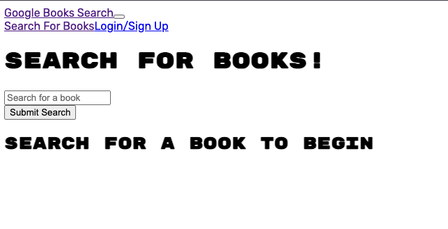
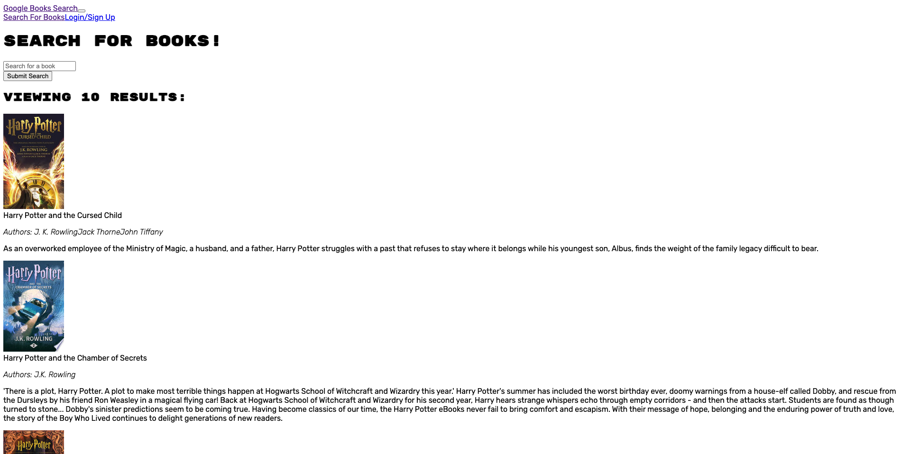
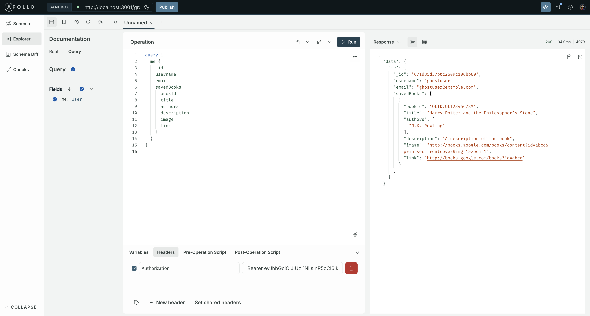

# 21 MERN: Book Search Engine

## Project Links
- [Github Repo](https://github.com/KateHanSta17/book-engine-search-challenge-21)
- [Render Deploy Link](https://book-engine-search-challenge-21.onrender.com) _<- NOTE that I was not able to finish due to time constraints. App is broken, more details below._

This is a full-stack MERN (MongoDB, Express, React, Node.js) application that allows users to search for books using the Google Books API and manage their saved books. The application uses GraphQL with Apollo Server for querying and managing data. The app was built with a React front end, Vite as a bundler, and is deployed using Render.

## Table of Contents
- [User Story](#user-story)
- [Acceptance Criteria](#acceptance-criteria)
- [Installation](#installation)
- [Environment Variables](#environment-variables)
- [Usage](#usage)
- [Deployment](#deployment)
- [Technologies Used](#technologies-used)
- [Known Issues](#known-issues)
- [Future Enhancements](#future-enhancements)
- [Screenshots](#screenshots)
- [License](#license)


## User Story
```
AS AN avid reader
I WANT to search for new books to read
SO THAT I can keep a list of books to purchase
```

## Acceptance Criteria
``` GIVEN a book search engine
WHEN I load the search engine
THEN I am presented with a menu with the options Search for Books and Login/Signup and an input field to search for books and a submit button 
```

## Installation
### Prerequisites
- Node.js (v16 or above recommended)
- MongoDB Atlas Account for the cloud database

### Steps to Install Locally
#### 1. Clone the repository:
```
git clone https://github.com/KateHanSta17/book-engine-search-challenge-21.git
``` 
#### 2. Navigate to the project directory:
```
cd book-engine-search-challenge-21
```
#### 3. Install dependencies for both the server and client:
```
npm install
cd client && npm install
```

4. _Set up MongoDB Atlas and whitelist your IP address (see Environment Variables section for more details)._

### 5. Start the server and client:
```
npm run start
```
## Environment Variables
Ensure you have a ```.env``` file in your server directory with the following environment variables set:
```
MONGODB_URI=mongodb+srv://<your-db-username>:<your-db-password>@<your-cluster-name>.mongodb.net/?retryWrites=true&w=majority
JWT_SECRET=your_secret_key_here
```
- MONGODB_URI: MongoDB connection string (provided by MongoDB Atlas).
- JWT_SECRET: A secret key for JWT token signing (you can generate this key using any random key generator).
Important: _You must whitelist your IP in MongoDB Atlas for local development. For more information, visit MongoDB Atlas Security Whitelisting._

## Usage
1. __Search for Books__: On the homepage, use the search bar to find books by entering a search term.
2. __Save Books__: If logged in, you can save books by clicking the Save button on the search results.
3. __View Saved Books__: Go to the Saved Books section to view and manage the books you’ve saved.
4. __Log in/Sign up__: Create an account or log in using the form available in the navigation bar.

## Deployment
__The application is deployed using Render.__

### Steps for Deployment on Render
1. Create a Render Account at render.com.
2. Create a New Web Service and link your GitHub repository.
3. Configure Environment Variables:
- ``` MONGODB_URI ``` for your MongoDB Atlas database connection string.
- ``` JWT_SECRET ``` for the JWT token.
4. Set the build and start commands in Render:
- Build Command:
```
npm install && npm run build
```
- Start Command:
```
npm run start
```
5. _Ensure you have whitelisted the IPs from Render in your MongoDB Atlas settings._

## Technologies Used
- MongoDB Atlas for cloud database.
- Express.js for building the server-side application.
- React for the front-end user interface.
- Node.js for the back-end runtime.
- Apollo Server for GraphQL queries and mutations.
- GraphQL for managing API requests and database interactions.
- Vite for bundling the React front-end.
- Render for deployment.

## Known Issues
- The current UI is basic and needs improvements for better user experience.
- There are warnings regarding deprecated options like useNewUrlParser and useUnifiedTopology in MongoDB's connection. These don't affect functionality but will need updating.
- Design responsiveness and styling still need work, especially for mobile and tablet devices.
- Login/Signup buttons are not working in production. Test correctly in Apollo.

## Future Enhancements
- Fix the login/signup buttons in production UI
- Implement a more polished user interface for better navigation and design.
- Add unit and integration tests for both the client and server.
- Add error handling and user feedback for invalid logins and failed book saves.

## Screenshots

### Screenshot of the homepage UI as it is right now (needs fixing in the future)


### Screenshot showing the search results from the Google Books API


### Screenshot showing the user functionality working during Apollo testing.

## License
This project is licensed under the MIT License. See the [LICENSE](./LICENSE) file for details.


----------


## Your Task

Your assignment this week is emblematic of the fact that most modern websites are driven by two things: data and user demands. This shouldn't come as a surprise, as the ability to personalize user data is the cornerstone of real-world web development today. And as user demands evolve, applications need to be more performant.

This week, you’ll take starter code with a fully functioning Google Books API search engine built with a RESTful API, and refactor it to be a GraphQL API built with Apollo Server. The app was built using the MERN stack with a React front end, MongoDB database, and Node.js/Express.js server and API. It's already set up to allow users to save book searches to the back end.

To complete the assignment, you’ll need to do the following:

1. Set up an Apollo Server to use GraphQL queries and mutations to fetch and modify data, replacing the existing RESTful API.

2. Modify the existing authentication middleware so that it works in the context of a GraphQL API.

3. Create an Apollo Provider so that requests can communicate with an Apollo Server.

4. Deploy your application to Render with a MongoDB database using MongoDB Atlas. Use the [Deploy with Render and MongoDB Atlas](https://coding-boot-camp.github.io/full-stack/mongodb/deploy-with-render-and-mongodb-atlas) walkthrough for instructions.

## User Story

```md
AS AN avid reader
I WANT to search for new books to read
SO THAT I can keep a list of books to purchase
```

## Acceptance Criteria

```md
GIVEN a book search engine
WHEN I load the search engine
THEN I am presented with a menu with the options Search for Books and Login/Signup and an input field to search for books and a submit button
WHEN I click on the Search for Books menu option
THEN I am presented with an input field to search for books and a submit button
WHEN I am not logged in and enter a search term in the input field and click the submit button
THEN I am presented with several search results, each featuring a book’s title, author, description, image, and a link to that book on the Google Books site
WHEN I click on the Login/Signup menu option
THEN a modal appears on the screen with a toggle between the option to log in or sign up
WHEN the toggle is set to Signup
THEN I am presented with three inputs for a username, an email address, and a password, and a signup button
WHEN the toggle is set to Login
THEN I am presented with two inputs for an email address and a password and login button
WHEN I enter a valid email address and create a password and click on the signup button
THEN my user account is created and I am logged in to the site
WHEN I enter my account’s email address and password and click on the login button
THEN I the modal closes and I am logged in to the site
WHEN I am logged in to the site
THEN the menu options change to Search for Books, an option to see my saved books, and Logout
WHEN I am logged in and enter a search term in the input field and click the submit button
THEN I am presented with several search results, each featuring a book’s title, author, description, image, and a link to that book on the Google Books site and a button to save a book to my account
WHEN I click on the Save button on a book
THEN that book’s information is saved to my account
WHEN I click on the option to see my saved books
THEN I am presented with all of the books I have saved to my account, each featuring the book’s title, author, description, image, and a link to that book on the Google Books site and a button to remove a book from my account
WHEN I click on the Remove button on a book
THEN that book is deleted from my saved books list
WHEN I click on the Logout button
THEN I am logged out of the site and presented with a menu with the options Search for Books and Login/Signup and an input field to search for books and a submit button  
```

## Mock-Up

Let's start by revisiting the web application's appearance and functionality.

As you can see in the following animation, a user can type a search term (in this case, "star wars") in a search box and the results appear:


The user can save books by clicking "Save This Book!" under each search result, as shown in the following animation:


A user can view their saved books on a separate page, as shown in the following animation:


## Getting Started

In order for this application to use a GraphQL API, you’ll need to refactor the API to use GraphQL on the back end and add some functionality to the front end. The following sections contain details about the files you’ll need to modify on the back end and the front end.

**Important**: Make sure to study the application before building upon it. Better yet, start by making a copy of it. It's already a working application&mdash;you're converting it from RESTful API practices to a GraphQL API.

### Back-End Specifications

You’ll need to complete the following tasks in each of these back-end files:

* `auth.js`: Update the auth middleware function to work with the GraphQL API.

* `server.js`: Implement the Apollo Server and apply it to the Express server as middleware.

* `Schemas` directory:

  * `index.js`: Export your typeDefs and resolvers.

  * `resolvers.js`: Define the query and mutation functionality to work with the Mongoose models.

  **Hint**: Use the functionality in the `user-controller.js` as a guide.

  * `typeDefs.js`: Define the necessary `Query` and `Mutation` types:

    * `Query` type:

      * `me`: Which returns a `User` type.
  
    * `Mutation` type:

      * `login`: Accepts an email and password as parameters; returns an `Auth` type.

      * `addUser`: Accepts a username, email, and password as parameters; returns an `Auth` type.

      * `saveBook`: Accepts a book author's array, description, title, bookId, image, and link as parameters; returns a `User` type. (Look into creating what's known as an `input` type to handle all of these parameters!)

      * `removeBook`: Accepts a book's `bookId` as a parameter; returns a `User` type.

    * `User` type:

      * `_id`

      * `username`

      * `email`

      * `bookCount`

      * `savedBooks` (This will be an array of the `Book` type.)

    * `Book` type:

      * `bookId` (Not the `_id`, but the book's `id` value returned from Google's Book API.)

      * `authors` (An array of strings, as there may be more than one author.)

      * `description`

      * `title`

      * `image`

      * `link`

    * `Auth` type:

      * `token`

      * `user` (References the `User` type.)

### Front-End Specifications

You'll need to create the following front-end files:

* `queries.js`: This will hold the query `GET_ME`, which will execute the `me` query set up using Apollo Server.

* `mutations.js`:

  * `LOGIN_USER` will execute the `loginUser` mutation set up using Apollo Server.

  * `ADD_USER` will execute the `addUser` mutation.

  * `SAVE_BOOK` will execute the `saveBook` mutation.

  * `REMOVE_BOOK` will execute the `removeBook` mutation.

Additionally, you’ll need to complete the following tasks in each of these front-end files:

* `App.jsx`: Create an Apollo Provider to make every request work with the Apollo Server.
 
* `SearchBooks.jsx`:

  * Use the Apollo `useMutation()` Hook to execute the `SAVE_BOOK` mutation in the `handleSaveBook()` function instead of the `saveBook()` function imported from the `API` file.

  * Make sure you keep the logic for saving the book's ID to state in the `try...catch` block!

* `SavedBooks.jsx`:

  * Remove the `useEffect()` Hook that sets the state for `UserData`.

  * Instead, use the `useQuery()` Hook to execute the `GET_ME` query on load and save it to a variable named `userData`.

  * Use the `useMutation()` Hook to execute the `REMOVE_BOOK` mutation in the `handleDeleteBook()` function instead of the `deleteBook()` function that's imported from `API` file. (Make sure you keep the `removeBookId()` function in place!)

* `SignupForm.jsx`: Replace the `addUser()` functionality imported from the `API` file with the `ADD_USER` mutation functionality.

* `LoginForm.jsx`: Replace the `loginUser()` functionality imported from the `API` file with the `LOGIN_USER` mutation functionality.

## Grading Requirements

> **Note**: If a Challenge assignment submission is marked as “0”, it is considered incomplete and will not count towards your graduation requirements. Examples of incomplete submissions include the following:
>
> * A repository that has no code
>
> * A repository that includes a unique name but nothing else
>
> * A repository that includes only a README file but nothing else
>
> * A repository that only includes starter code

This Challenge is graded based on the following criteria:

### Technical Acceptance Criteria: 40%

* Satisfies all of the preceding acceptance criteria plus the following:

  * Has an Apollo Server that uses GraphQL queries and mutations to fetch and modify data, replacing the existing RESTful API.

  * Use an Apollo Server and apply it to the Express.js server as middleware.

  * Include schema settings for resolvers and typeDefs as outlined in the Challenge instructions.

  * Modify the existing authentication middleware to work in the context of a GraphQL API.

  * Use an Apollo Provider so that the application can communicate with the Apollo Server.

  * Application must be deployed to Render.

### Deployment: 32%

* Application deployed at live URL.

* Application loads with no errors.

* Application GitHub URL submitted.

* GitHub repository contains application code.

### Application Quality: 15%

* User experience is intuitive and easy to navigate.

* User interface style is clean and polished.

* Application resembles the mock-up functionality provided in the Challenge instructions.

### Repository Quality: 13%

* Repository has a unique name.

* Repository follows best practices for file structure and naming conventions.

* Repository follows best practices for class/id naming conventions, indentation, quality comments, etc.

* Repository contains multiple descriptive commit messages.

* Repository contains high-quality README file with description, screenshot, and link to the deployed application.

## Review

You are required to submit BOTH of the following for review:

* The URL of the functional, deployed application.

* The URL of the GitHub repository. Give the repository a unique name and include a README describing the project.

---
© 2024 edX Boot Camps LLC. Confidential and Proprietary. All Rights Reserved.
